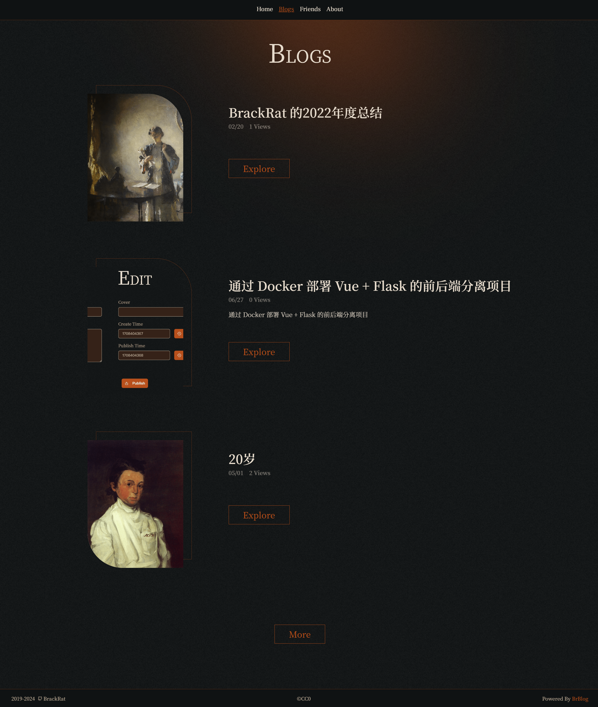
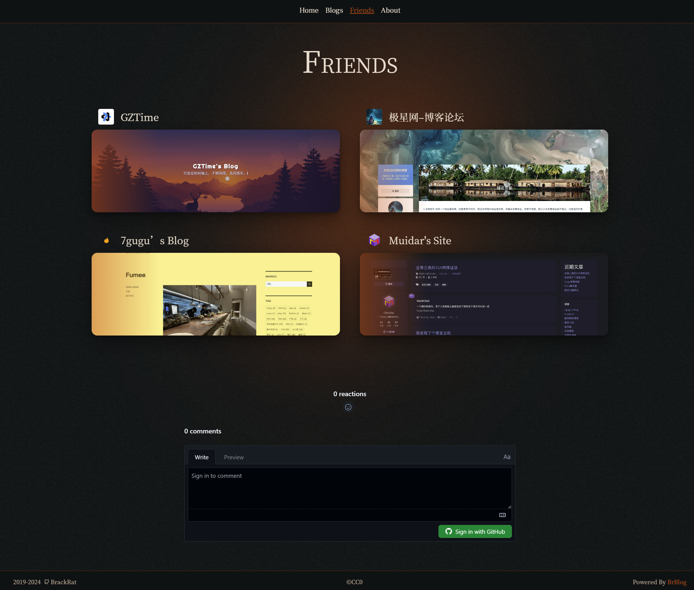
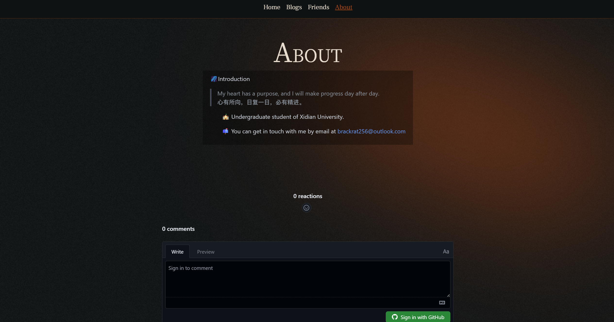
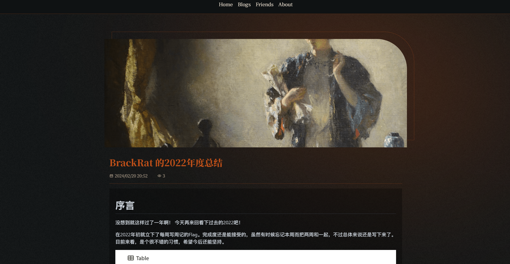
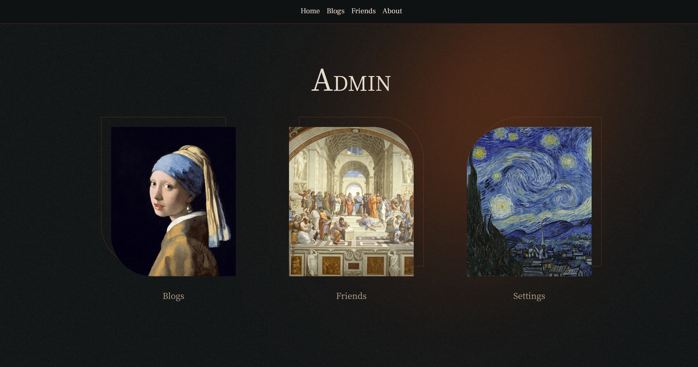
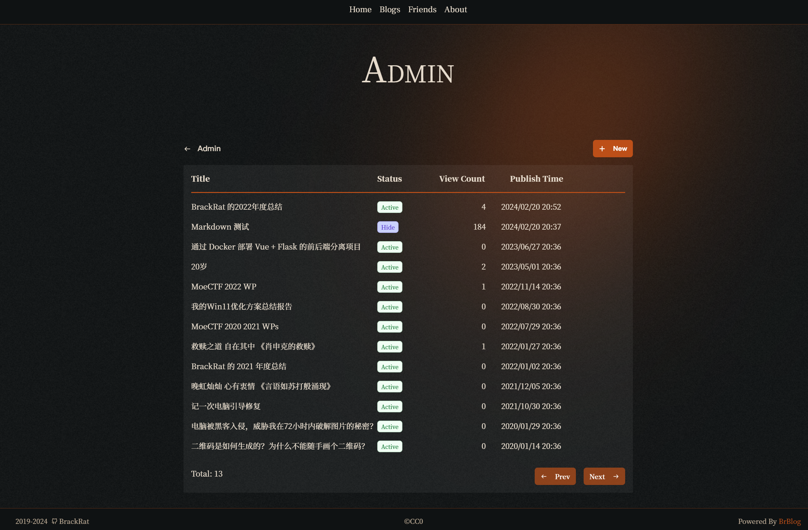
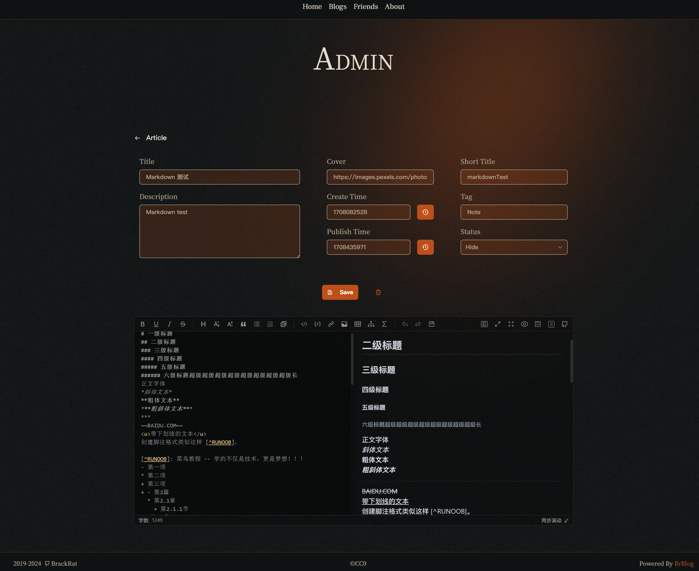
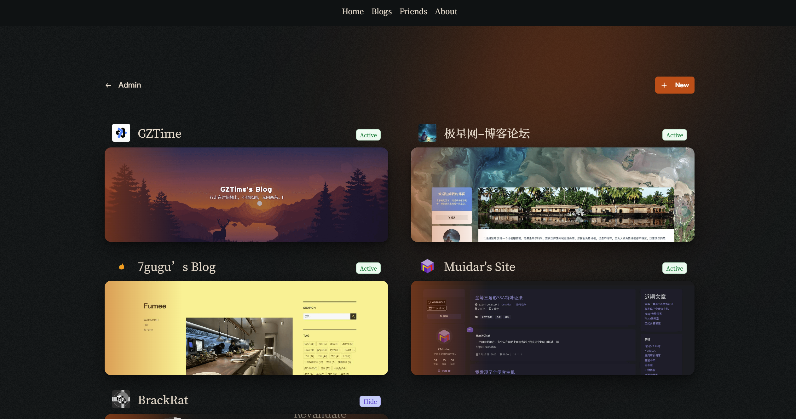

# BrBlog

优雅至上的个人博客网站。

欢迎来到文艺复兴时期。

## ✨ 特征

1. 🌟 **SEO 友好** 由 Nuxt3 驱动。
2. 🖼 **文艺复兴** UI设计将带你回到 14-16 世纪
3. 📑 **后台管理** 支持后台发布/编辑文章等
4. 📝 **Markdown** 使用轻量的标记语言编写文章
5. ⚡ **快！** 性能优秀

## 🛠️ 技术栈

- Nuxt3
- Tailwind CSS
- Prisma
- Md-editor-v3
- Pinia
- Giscus

## 📑 部署文档

[部署与维护说明](docs/deployment.md)

## 📷 截图

### Home

### Blogs

### Friends

### About

### Article

### Admin Home

### Admin Article

### Admin Article Edit

### Admin Friends

## 😺 关于

AGPL-3.0 license

2024 © BrackRat